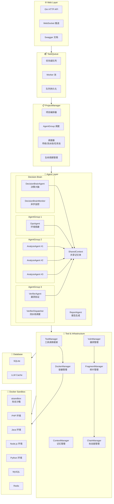
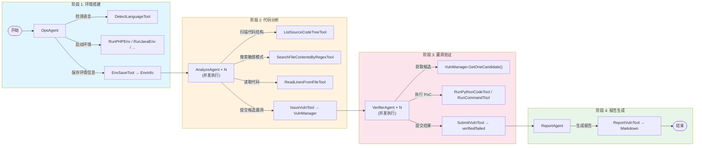
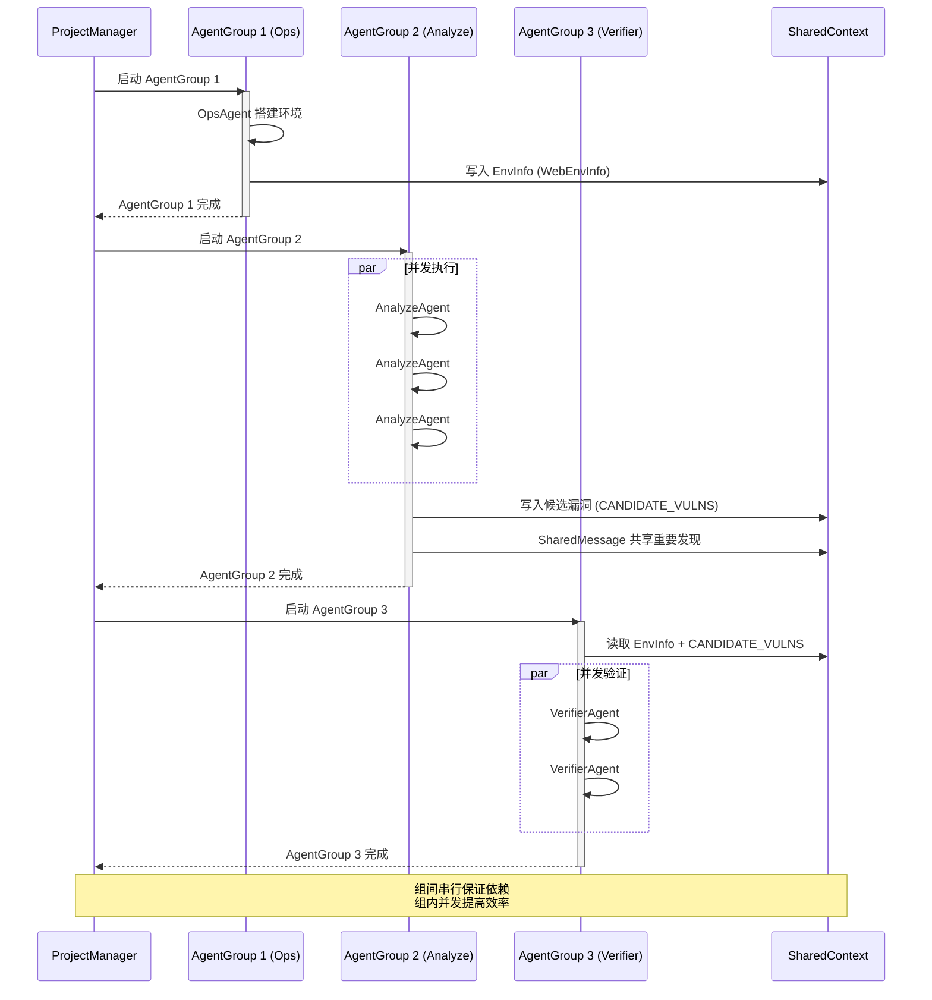

# AIxVuln(下个版本更新内容)

AIxVuln 是一个基于大模型（LLM）+ 工具调用（Function Calling）+ Docker 沙箱的**自动化漏洞挖掘与验证系统**。

系统通过 Web API 管理"项目(Project)"，为每个项目自动组织多类 Agent（环境搭建/代码审计/漏洞验证/报告生成），并在隔离的 Docker 环境内完成依赖安装、服务启动、PoC 验证与证据采集，最终产出可下载的报告。

> 🎯 已通过该项目在真实目标中发现**数十个真实漏洞**。

## 核心能力

- **多 Agent 智能协作**：Ops / Analyze / Verifier / Report 四类 Agent 分工协作，通过 SharedContext 共享关键信息
- **Docker 沙箱隔离**：所有代码执行、PoC 验证均在隔离容器中进行，支持 PHP/Java/Node.js/Python/Go 多语言环境
- **端到端自动化**：从源码上传到漏洞报告生成，全流程自动化，无需人工干预
- **实时可观测**：WebSocket 推送实时事件，支持漏洞发现/验证状态跟踪

## 界面预览

系统主界面：


运行中实时漏洞列表（未验证）：


实时产生的漏洞报告（已验证）：


---

## 项目整体架构



### 架构层级说明

| 层级 | 组件 | 职责 |
|------|------|------|
| **Web Layer** | Gin + WebSocket + Swagger | HTTP API、实时事件推送、交互式文档 |
| **TaskQueue** | Queue + WorkerPool + Persistence | 优先级任务队列、并发控制、队列持久化 |
| **ProjectManager** | Orchestrator + AgentGroup + Scheduler | 项目生命周期管理、Agent 分组调度、支持多种调度模式 |
| **Agent Layer** | Decision/Ops/Analyze/Verifier/Report | 决策大脑协调、各类智能体执行任务，通过 SharedContext 共享信息 |
| **Tool & Infrastructure** | ToolManager + Managers | 工具调用框架、容器/漏洞/碎片/攻击链管理 |
| **Docker Sandbox** | 多语言容器 + 中间件 | 隔离执行环境，源码挂载于 `/sourceCodeDir` |
| **Database** | SQLite + LLM Cache | 项目/漏洞/碎片/攻击链数据持久化、LLM 响应缓存 |

---

## Agent 工作流程

### 完整漏洞挖掘流程（StartCommonVulnTask）



### AgentGroup 调度机制



### SharedContext 信息共享协议

Agent 之间通过两种机制共享信息：

1. **KeyMessage（关键消息）**：持久化存储，所有 Agent 可读取
   - `WebEnvInfo`: 运行环境信息（端口、地址、登录凭据等）
   - `CANDIDATE_VULNS`: 候选漏洞列表

2. **SharedMessage（共享消息）**：实时广播，Agent 回复末尾添加 `SharedMessage:` 前缀
   - 用于实时共享重要发现、线索、可利用路径等
   - 其他 Agent 在后续推理中可感知并利用

---

## 框架技术介绍

### 核心模块

| 模块 | 职责 | 关键文件 |
|------|------|----------|
| **Web/** | HTTP API + WebSocket 推送 + Swagger 文档 | `Route.go`, `Server.go`, `WebSocketImp.go` |
| **ProjectManager/** | 项目级编排、AgentGroup 调度、多种调度模式 | `ProjectManager.go`, `Start.go` |
| **agents/** | Agent 接口定义与实现（Decision/Ops/Analyze/Verifier/Report） | `base.go`, `AgentCore.go`, `*Agent.go` |
| **llm/** | 记忆体管理、LLM 缓存、分层记忆 | `ContextManager.go`, `SharedContext.go`, `Cache.go`, `TieredMemory.go` |
| **toolCalling/** | LLM 工具调用框架与 40+ 工具实现 | `ToolManager.go`, `*Tool.go` |
| **dockerManager/** | Docker 容器操作封装 + 连接池 | `core.go`, `pool.go`, `service.go` |
| **taskManager/** | 任务/沙箱/漏洞/碎片/攻击链/检查点管理 | `Task.go`, `VulnManager.go`, `FragmentManager.go`, `ChainManager.go` |
| **taskQueue/** | 优先级任务队列、Worker 池、队列持久化 | `Queue.go`, `Worker.go`, `Persistence.go` |
| **database/** | SQLite 数据持久化、JSON 迁移工具 | `database.go`, `schema.go`, `*_repo.go` |

### 技术选型

| 技术 | 选择 | 原因 |
|------|------|------|
| **语言** | Go 1.24+ | 高并发 goroutine、静态类型安全、单二进制部署 |
| **Web 框架** | Gin | 轻量高性能、中间件生态丰富 |
| **WebSocket** | gorilla/websocket | 成熟稳定的 Go WebSocket 库 |
| **LLM SDK** | sashabaranov/go-openai | OpenAI 风格 API，兼容多厂商模型 |
| **容器** | Docker Engine API | 原生 Go 调用，无需 CLI 依赖 |
| **数据库** | SQLite (modernc.org/sqlite) | 纯 Go 实现，无 CGO 依赖，单文件部署 |
| **配置** | INI 格式 | 简单直观，支持多 section |

### 关键设计特性

#### 1. AgentCore 基类模式

所有 Agent 继承 `AgentCore`，复用公共逻辑：

```go
type AgentCore struct {
    Memory            llm.Memory
    Client            *toolCalling.ToolManager
    Task              *taskManager.Task
    PlanManager       *toolCalling.PlanManager       // 规划管理
    CheckpointManager *taskManager.CheckpointManager // 检查点
    PriorityEnforcer  *PriorityEnforcer              // 优先级策略
}

// 子类只需实现 Name() 和 StartTask()
type OpsCommonAgent struct {
    AgentCore // 嵌入基类
}
```

#### 2. Memory 接口抽象

支持两种记忆模式：

```go
type Memory interface {
    AddMessage(x *MessageX)
    GetContext(id string) []openai.ChatCompletionMessage
    AddKeyMessage(x *EnvMessageX)
    SetKeyMessage(env map[string][]interface{}, id string)
    // ...
}

// ContextManager: 单 Agent 独立上下文
// SharedContext:  多 Agent 共享上下文 + SharedMessage 广播
```

#### 3. ToolHandler 接口

统一工具注册与调用：

```go
type ToolHandler interface {
    Name() string
    Description() string
    Parameters() map[string]interface{}
    Execute(args map[string]interface{}) string
}

// 注册示例
agent.RegisterTool(toolCalling.NewRunCommandTool(task))
agent.RegisterTool(toolCalling.NewDockerExecTool(task))
```

---

## 工具分类

### 环境搭建工具

| 工具 | 功能 |
|------|------|
| `DetectLanguageTool` | 检测项目编程语言 |
| `RunPHPEnvTool` | 启动 PHP + Apache 环境 |
| `RunJavaEnvTool` | 启动 Java 多版本 JDK 环境 |
| `RunNodeEnvTool` | 启动 Node.js 环境 |
| `RunPythonEnvTool` | 启动 Python 环境 |
| `RunGolangEnvTool` | 启动 Go 环境 |
| `RunMySQLEnvTool` | 启动 MySQL 数据库 |
| `RunRedisEnvTool` | 启动 Redis 缓存 |
| `EnvSaveTool` | 保存环境信息到记忆体 |

### Docker 容器工具

| 工具 | 功能 |
|------|------|
| `DockerRunTool` | 创建并运行容器 |
| `DockerExecTool` | 在容器内执行命令 |
| `DockerLogsTool` | 获取容器日志 |
| `DockerPsTool` | 列出运行中的容器 |
| `DockerRemoveTool` | 删除容器 |
| `DockerDirScanTool` | 扫描容器内目录 |
| `DockerFileReadTool` | 读取容器内文件 |

### 代码分析工具

| 工具 | 功能 |
|------|------|
| `ListSourceCodeTreeTool` | 列出源码目录结构 |
| `SearchFileContentsByRegexTool` | 正则搜索文件内容 |
| `ReadLinesFromFileTool` | 读取指定文件行 |

### 漏洞挖掘工具

| 工具 | 功能 |
|------|------|
| `IssueVulnTool` | 提交候选漏洞 |
| `SubmitVulnTool` | 提交验证结果（verified/failed） |
| `ReportVulnTool` | 生成漏洞报告 |
| `IssueTool` | 通用问题提交工具 |

### 执行工具

| 工具 | 功能 |
|------|------|
| `RunCommandTool` | 在沙箱中执行命令 |
| `RunPythonCodeTool` | 执行 Python 代码 |
| `RunPHPCodeTool` | 执行 PHP 代码 |
| `RunSQLTool` | 执行 SQL 语句 |

### 规划与检查点工具

| 工具 | 功能 |
|------|------|
| `PlanningTool` | 任务规划与分解 |
| `TaskListTool` | 获取/更新任务列表 |
| `CheckpointTools` | 创建/回滚检查点 |
| `SummarizeProgressTool` | 汇总当前进度 |

### 碎片与攻击链工具

| 工具 | 功能 |
|------|------|
| `GetFragmentsTool` | 获取碎片利用点列表 |
| `UpdateFragmentStatusTool` | 更新碎片状态 |
| `CreateChainTool` | 创建攻击链 |
| `AddChainStepTool` | 添加攻击链步骤 |
| `GetChainsTool` | 获取攻击链列表 |
| `AnalyzeChainTool` | 分析攻击链可行性 |

### 决策与通信工具

| 工具 | 功能 |
|------|------|
| `DecisionMessageTool` | 发送决策消息 |
| `SharedMessageTool` | Agent 间共享消息 |
| `SetAnalysisPriorityTool` | 设置分析优先级 |

---

## 配置

配置文件为根目录 `config.ini`。详细配置说明见 [docs/CONFIGURATION.md](docs/CONFIGURATION.md)。

### 基础配置

```ini
[misc]
DATA_DIR = ./data           # 数据目录
MaxRequest = 5              # 全局 LLM API 最大并发
MaxTryCount = 3             # 请求失败最大重试次数

[main_setting]
BASE_URL = https://api.openai.com/v1   # OpenAI 风格 API Base URL
OPENAI_API_KEY = sk-xxx                # API Key（支持 |-| 分隔多个 key 轮询）
MODEL = gpt-4                          # 默认模型名
```

### Agent 模型配置

可按 Agent 类型覆盖模型配置：

```ini
[ops]
MODEL = gpt-4

[analyze]
MODEL = gpt-4

[verifier]
MODEL = gpt-4
```

### 高级配置

```ini
[auth]
USERNAME = admin           # Basic Auth 用户名
PASSWORD = your_password   # Basic Auth 密码

[log]
LOG_LEVEL = info           # 日志级别 (debug/info/warn/error)
LOG_FORMAT = console       # 输出格式 (console/json)

[cache]
ENABLE_CACHE = true        # 是否启用 LLM 缓存
CACHE_TTL = 3600           # 缓存过期时间（秒）
CACHE_MAX_SIZE = 1000      # 最大缓存条目数
CACHE_PERSIST_FILE = ./data/llm_cache.json  # 缓存持久化文件
```

### 任务队列配置

```ini
[queue]
MaxConcurrentTasks = 2     # 最大并发任务数
MaxRetryCount = 3          # 任务失败最大重试次数
RetryBackoffSeconds = 30   # 重试退避基础秒数（指数退避）
EnablePersistence = true   # 是否启用队列持久化
AutoSaveInterval = 5       # 队列自动保存间隔（秒）
```

### Decision Brain 配置

```ini
[decision]
Enabled = true             # 是否启用决策驱动模式
# MODEL = gpt-4-turbo      # Decision Brain 使用的模型（可选）
# 决策介入点：start/post_ops/mid_analysis/pre_verify/final
Intervention_Points = start,post_ops,mid_analysis,final
MinDecisionInterval = 30   # 异步决策最小间隔（秒）
EventAggregationWindow = 500  # 事件聚合窗口（毫秒）
```

### 调度器配置

```ini
[scheduler]
EnablePipelineVerifier = true  # 启用流水线式 Verifier 调度
MinVerifiers = 1               # 最小 Verifier 数量
MaxVerifiers = 5               # 最大 Verifier 数量（动态扩容上限）
ScaleUpThreshold = 3           # 触发扩容的 pending 阈值
ScaleDownIdleSeconds = 60      # 空闲缩容时间（秒）

# 任务池模式（与流水线模式互斥，任务池优先级更高）
EnableTaskPool = false         # 启用任务池模式
PoolWorkerCount = 6            # Worker 池总数量
PoolWorkerIdleTimeout = 120    # Worker 空闲超时（秒）
```

### 优化特性配置

```ini
[optimization]
EnablePlanning = true              # 启用显式规划
PlanningGranularity = coarse       # 规划粒度 (coarse/medium/fine)
AdaptivePlanning = true            # 自适应规划
EnableCheckpoint = true            # 启用检查点
EnablePriorityEnforcement = false  # 启用优先级强制执行
EnableTieredMemory = false         # 启用分层记忆
EnableAsyncDecisionBrain = false   # 启用异步 Decision Brain
```

### 分层记忆配置

```ini
[memory]
WorkingMemoryRounds = 10   # 工作记忆保留的对话轮次
ImportantMemorySize = 20   # 重要记忆最大条目数
AutoSummarize = true       # 自动生成摘要
SummarizeThreshold = 8     # 触发摘要的阈值
```

### 检查点配置

```ini
[checkpoint]
MaxCheckpoints = 5         # 最大检查点数量
RetentionHours = 24        # 检查点保留时间（小时）
```

---

## Docker 镜像

### aisandbox（攻击沙箱）

提供常用安全测试工具与运行时依赖，用于 PoC 验证和攻击脚本执行。

```bash
docker build -t aisandbox -f dockerfile/dockerfile.aisandbox/Dockerfile dockerfile/dockerfile.aisandbox
```

### java_env（Java 环境）

提供 Java 多版本 JDK 与常用构建工具（Maven、Gradle）。

```bash
docker build -t java_env -f dockerfile/dockerfile.java_env/Dockerfile dockerfile/dockerfile.java_env
```

---

## 目录结构

```text
.
├── main.go                 # 程序入口
├── config.ini              # 配置文件
├── Web/                    # HTTP API + WebSocket 推送
│   ├── Route.go            # 路由定义
│   ├── Server.go           # 服务器启动与持久化
│   ├── WebSocketImp.go     # WebSocket 实现
│   ├── Base.go             # 基础结构定义
│   ├── Misc.go             # 工具函数
│   └── models.go           # 数据模型
├── ProjectManager/         # 项目级编排、并发与生命周期管理
│   ├── ProjectManager.go   # 核心管理器
│   ├── Start.go            # 任务启动流程定义
│   └── Base.go             # 基础结构
├── agents/                 # Agent 实现
│   ├── base.go             # Agent 接口定义
│   ├── AgentCore.go        # Agent 基类
│   ├── OpsCommonAgent.go   # 环境搭建 Agent
│   ├── AnalyzeCommonAgent.go   # 代码分析 Agent
│   ├── VerifierCommonAgent.go  # 漏洞验证 Agent
│   ├── ReportCommonAgent.go    # 报告生成 Agent
│   ├── DecisionBrainAgent.go   # 决策大脑 Agent
│   ├── DecisionBrainMonitor.go # 异步决策监控器
│   ├── TaskPoolScheduler.go    # 任务池调度器
│   ├── PooledAgentWorker.go    # 池化 Agent Worker
│   ├── VerifierDispatcher.go   # 流水线 Verifier 调度器
│   └── PriorityEnforcer.go     # 优先级强制执行器
├── taskManager/            # 任务与运行时管理
│   ├── Task.go             # 任务结构
│   ├── Sandbox.go          # 沙箱管理
│   ├── VulnManager.go      # 漏洞管理
│   ├── FragmentManager.go  # 碎片利用点管理
│   ├── ChainManager.go     # 攻击链管理
│   ├── CheckpointManager.go # 检查点管理
│   ├── EventBus.go         # 事件总线
│   ├── Progress.go         # 进度追踪
│   └── Base.go             # 基础结构定义
├── taskQueue/              # 任务队列管理
│   ├── Queue.go            # 优先级任务队列
│   ├── Worker.go           # 工作池与任务执行
│   ├── Persistence.go      # 队列持久化
│   └── AgentTaskPool.go    # Agent 任务池
├── database/               # SQLite 数据库持久化
│   ├── database.go         # 数据库初始化
│   ├── schema.go           # 表结构定义
│   ├── migrate.go          # JSON 迁移工具
│   ├── project_repo.go     # 项目数据仓库
│   ├── vuln_repo.go        # 漏洞数据仓库
│   ├── fragment_repo.go    # 碎片数据仓库
│   ├── chain_repo.go       # 攻击链数据仓库
│   └── ...                 # 其他数据仓库
├── toolCalling/            # LLM Tool 调用与工具实现
│   ├── ToolManager.go      # 工具管理器
│   └── *Tool.go            # 各类工具实现（40+ 工具）
├── dockerManager/          # Docker 操作封装 + ServiceManager
│   ├── core.go             # Docker API 封装
│   ├── pool.go             # Docker 连接池
│   └── service.go          # 语言环境服务
├── llm/                    # 上下文与记忆体管理
│   ├── ContextManager.go   # 单 Agent 上下文
│   ├── SharedContext.go    # 多 Agent 共享上下文
│   ├── Cache.go            # LLM 响应缓存
│   ├── TieredMemory.go     # 分层记忆
│   └── base.go             # Memory 接口定义
├── misc/                   # 配置/工具函数/任务模板
├── dockerfile/             # 镜像构建目录
│   ├── dockerfile.aisandbox/
│   └── dockerfile.java_env/
├── docs/                   # 文档目录
│   ├── CONFIGURATION.md    # 详细配置说明
│   ├── API.md              # API 文档
│   └── images/             # 文档图片
└── data/                   # 运行时数据
    ├── projects/           # 项目数据
    ├── aixvuln.db          # SQLite 数据库
    └── llm_cache.json      # LLM 缓存文件
```

---

## 快速开始

### 前置条件

- **Go 1.24+**（与 `go.mod` 保持一致）
- **Docker** 已安装并启动
- 已构建依赖的 Docker 镜像：`aisandbox`、`java_env`

### 1. 构建 Docker 镜像

```bash
docker build -t aisandbox -f dockerfile/dockerfile.aisandbox/Dockerfile dockerfile/dockerfile.aisandbox
docker build -t java_env -f dockerfile/dockerfile.java_env/Dockerfile dockerfile/dockerfile.java_env
```

### 2. 配置

复制并编辑配置文件：

```bash
cp config.ini.example config.ini
# 编辑 config.ini，填入你的 API Key 等配置
```

### 3. 运行

```bash
go run .
```

默认监听：`0.0.0.0:9999`

### 4. 访问 API 文档

启动后访问 Swagger UI 查看交互式 API 文档：

```
http://localhost:9999/swagger/index.html
```

### 5. 前端 UI（可选）

本仓库不提供前端 UI。如需可视化交互，请启动前端仓库：

```
https://github.com/qqliushiyu/AIxVuln_Web
```

### 6. 运行（二进制）

你也可以直接从 GitHub Releases 下载已编译的二进制文件运行。

---

## API 端点

### 项目管理

| 方法 | 端点 | 说明 |
|------|------|------|
| `GET` | `/projects` | 获取所有项目列表 |
| `POST` | `/projects/create?projectName=xxx` | 上传源代码压缩包创建项目 |
| `GET` | `/projects/:name` | 获取项目详情（状态、漏洞、容器、事件、进度） |
| `GET` | `/projects/:name/start?startType=0\|1\|2&priority=N` | 启动项目（0=完整流程, 1=仅分析, 2=决策驱动） |
| `GET` | `/projects/:name/cancel` | 取消运行中的任务 |
| `GET` | `/projects/:name/del` | 删除项目 |
| `GET` | `/projects/:name/containers` | 获取项目容器列表 |
| `GET` | `/projects/:name/events?count=N` | 获取项目事件日志 |
| `GET` | `/projects/:name/envinfo` | 获取项目环境信息 |
| `GET` | `/projects/:name/agents` | 获取 Agent 运行状态 |

### 漏洞与报告

| 方法 | 端点 | 说明 |
|------|------|------|
| `GET` | `/projects/:name/vulns` | 获取漏洞列表 |
| `GET` | `/projects/:name/reports` | 获取报告列表 |
| `GET` | `/projects/:name/reports/download/:id` | 下载单个报告 |
| `GET` | `/projects/:name/reports/downloadAll` | 下载所有报告（ZIP） |

### 碎片化利用点

| 方法 | 端点 | 说明 |
|------|------|------|
| `GET` | `/projects/:name/fragments` | 获取碎片列表 |
| `GET` | `/projects/:name/fragments/:id` | 获取单个碎片详情 |
| `POST` | `/projects/:name/fragments` | 创建新碎片 |
| `PUT` | `/projects/:name/fragments/:id` | 更新碎片信息 |
| `DELETE` | `/projects/:name/fragments/:id` | 删除碎片 |
| `POST` | `/projects/:name/fragments/:id/relate` | 关联多个碎片 |
| `POST` | `/projects/:name/fragments/:id/unrelate` | 取消碎片关联 |

### 攻击链

| 方法 | 端点 | 说明 |
|------|------|------|
| `GET` | `/projects/:name/chains` | 获取攻击链列表 |
| `GET` | `/projects/:name/chains/:id` | 获取单个攻击链详情 |
| `POST` | `/projects/:name/chains` | 创建攻击链 |
| `PUT` | `/projects/:name/chains/:id` | 更新攻击链 |
| `DELETE` | `/projects/:name/chains/:id` | 删除攻击链 |
| `POST` | `/projects/:name/chains/:id/steps` | 添加攻击链步骤 |
| `DELETE` | `/projects/:name/chains/:id/steps/:order` | 删除攻击链步骤 |

### 任务队列

| 方法 | 端点 | 说明 |
|------|------|------|
| `GET` | `/queue` | 获取队列状态（待执行/运行中任务） |
| `GET` | `/queue/tasks/:taskId` | 获取任务详情 |
| `POST` | `/queue/tasks/:taskId/priority?priority=N` | 更新任务优先级 |
| `DELETE` | `/queue/tasks/:taskId` | 取消队列任务 |

### 缓存管理

| 方法 | 端点 | 说明 |
|------|------|------|
| `GET` | `/cache/stats` | 获取 LLM 缓存统计信息 |
| `POST` | `/cache/clear` | 清空 LLM 缓存 |

### 实时通信

| 方法 | 端点 | 说明 |
|------|------|------|
| `GET` | `/ws` | WebSocket 连接，接收实时事件 |

**认证**：Basic Auth（默认 `admin:ss0t`，可在配置文件中修改）

---

## 高级功能

### 任务队列

系统支持优先级任务队列，实现多项目并发控制：

- **优先级调度**：数值越大优先级越高，支持动态调整
- **并发控制**：`MaxConcurrentTasks` 配置同时运行的任务数
- **失败重试**：指数退避策略自动重试
- **队列持久化**：服务重启后恢复未完成任务

### 碎片化利用点

碎片化利用点用于记录单独不能构成完整漏洞但有利用价值的发现：

- **状态管理**：discovered → analyzing → confirmed → chained/dismissed
- **关联关系**：多个碎片可建立关联，便于串联分析
- **双来源**：Agent 自动发现 + 用户手动添加

### 攻击链

攻击链将多个碎片串联为完整的利用路径：

- **步骤序列**：每步包含前置条件、执行动作、预期结果
- **可行性评分**：0-100 评分，辅助判断攻击链成功率
- **影响级别**：low/medium/high/critical
- **状态跟踪**：draft → analyzing → confirmed → executed

### Decision Brain 决策驱动模式

Decision Brain 提供智能决策层，协调各 Agent 工作：

- **介入点**：
  - `start`: 任务开始前分析项目特征
  - `post_ops`: 环境搭建后调整策略
  - `mid_analysis`: 分析中期评估进度
  - `final`: 最终汇总与建议
- **异步监控**：可启用 `DecisionBrainMonitor` 实时监听事件并触发决策

启动决策驱动模式：`/projects/:name/start?startType=2`

### 调度模式

系统支持三种 Verifier 调度模式：

1. **传统模式**：Analyze 完成后才启动 Verifier（默认）
2. **流水线模式**：Analyze 运行期间 Verifier 并行工作，动态扩缩容
3. **任务池模式**：统一 Worker 池处理所有任务，资源利用率更高

配置 `[scheduler]` 节选择调度模式。

### LLM 缓存

系统支持 LLM 响应缓存，减少重复请求：

- **内存缓存**：基于请求内容哈希
- **持久化**：服务重启后恢复缓存
- **统计信息**：通过 `/cache/stats` 查看命中率

### 检查点与回滚

Agent 可在风险操作前创建检查点，失败后回滚恢复：

- 保存当前记忆、漏洞列表、环境信息
- 支持多个检查点，按时间自动清理

---

## 扩展指南

### 新增工具

1. 在 `toolCalling/` 中创建 `YourTool.go`，实现 `ToolHandler` 接口
2. 在相关 Agent 构造函数中注册：`agent.RegisterTool(toolCalling.NewYourTool(task))`

### 新增 Agent

1. 在 `agents/` 中创建 `YourAgent.go`，嵌入 `AgentCore` 并实现 `Agent` 接口
2. 在 `ProjectManager/Start.go` 中添加到相应的 AgentGroup

### 新增运行环境

1. 在 `dockerManager/service.go` 中添加 `StartXxxEnv()` 方法
2. 创建对应工具 `toolCalling/RunXxxEnvTool.go`
3. 在 OpsAgent 中注册该工具

---

## 注意事项

- ⚠️ 本项目会启动并控制 Docker 容器，请在**隔离环境**中使用
- ⚠️ 配置文件中包含 API Key 等敏感信息，建议使用 `.gitignore` 管理或改用环境变量
- ⚠️ 默认认证凭据仅供开发测试，生产环境请务必修改

---

## License

MIT License
